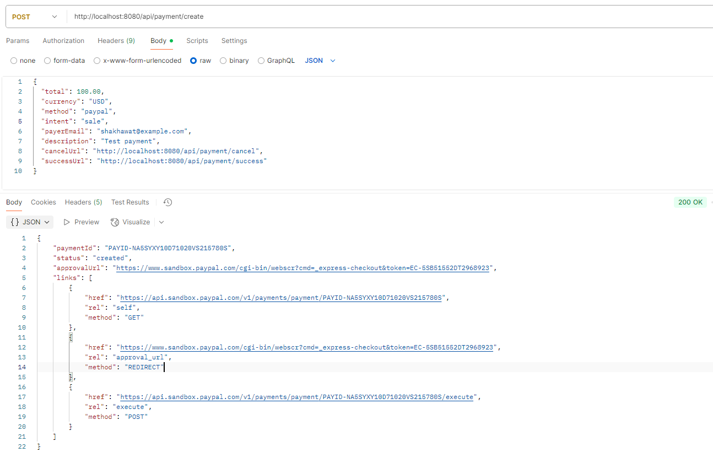
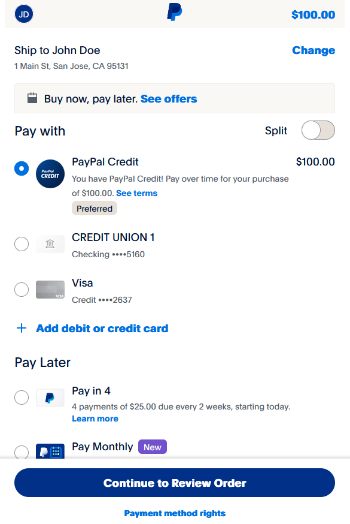
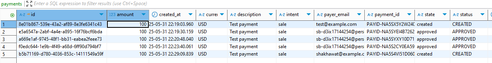

# PayPal integration with Spring Boot

**Description:**
A Spring Boot application that demonstrates integration with PayPal’s REST API for payment processing. The project uses Java 21, Spring Boot 3.4.5, and the official PayPal Java SDK. It also leverages PostgreSQL for data persistence and includes JPA for ORM and validation support.

**Key Features:**
- RESTful API endpoints built with Spring Boot
- PayPal payment integration using the official SDK
- PostgreSQL database support (runtime)
- Data validation and JPA-based persistence
- Lombok for boilerplate code reduction
- Ready for testing with Spring Boot’s test starter

**Tech Stack:**
- Java 21
- Spring Boot 3.4.5
- PayPal REST API SDK (v1.14.0)
- PostgreSQL
- Lombok
- Maven

**Getting Started:**
- Clone the repository
- Configure your PayPal credentials and database connection in `application.properties`
- Build and run the application using Maven

**Build & Run:**
```bash
mvn clean install
mvn spring-boot:run
```

## Screenshots
### API Payment Creation via Postman

### Payment GUI

### Database Payment Record


**Testing:**
```bash
mvn test
```

***Payload for Create Payment***
#### POST http://localhost:8080/api/payment/create
```json
{
  "id": "WH-1WR23456GH789012I-1XY23456GH7890123",
  "event_version": "1.0",
  "create_time": "2025-06-24T10:35:00Z",
  "resource_type": "sale",
  "event_type": "PAYMENT.SALE.COMPLETED",
  "summary": "Payment completed for $30.00 USD",
  "resource": {
    "id": "9AB23456CD7890123",
    "state": "COMPLETED",
    "amount": {
      "total": "30.00",
      "currency": "USD"
    },
    "payment_mode": "INSTANT_TRANSFER",
    "protection_eligibility": "ELIGIBLE",
    "create_time": "2025-06-24T10:30:00Z",
    "update_time": "2025-06-24T10:35:00Z",
    "parent_payment": "PAY-12345678901234567"
  },
  "links": [
    {
      "href": "https://api.paypal.com/v1/payments/sale/9AB23456CD7890123",
      "rel": "self",
      "method": "GET"
    }
  ]
}
```

***Payload for Webhook***
#### POST: http://localhost:8080/api/webhook/paypal
### Capture
```json
{
    "id": "WH-9RR12345AA678901B-12345678DEADBEEF1",
    "event_version": "1.0",
    "create_time": "2025-06-24T10:35:00Z",
    "resource_type": "capture",
    "event_type": "PAYMENT.CAPTURE.COMPLETED",
    "summary": "Payment completed for $100.00 USD",
    "resource": {
        "id": "9B87654321",
        "amount": {
            "currency_code": "USD",
            "value": "100.00"
        },
        "status": "COMPLETED",
        "final_capture": true,
        "seller_protection": {
            "status": "ELIGIBLE"
        },
        "create_time": "2025-06-24T10:00:00Z",
        "update_time": "2025-06-24T10:35:00Z"
    },
    "links": [
        {
            "href": "https://api.paypal.com/v2/checkout/orders/9B87654321",
            "rel": "self",
            "method": "GET"
        }
    ]
}
```
### Sale
```json
{
  "id": "WH-1WR23456GH789012I-1XY23456GH7890123",
  "event_version": "1.0",
  "create_time": "2025-06-24T10:35:00Z",
  "resource_type": "sale",
  "event_type": "PAYMENT.SALE.COMPLETED",
  "summary": "Payment completed for $30.00 USD",
  "resource": {
    "id": "9AB23456CD7890123",
    "state": "COMPLETED",
    "amount": {
      "total": "30.00",
      "currency": "USD"
    },
    "payment_mode": "INSTANT_TRANSFER",
    "protection_eligibility": "ELIGIBLE",
    "create_time": "2025-06-24T10:30:00Z",
    "update_time": "2025-06-24T10:35:00Z",
    "parent_payment": "PAY-12345678901234567"
  },
  "links": [
    {
      "href": "https://api.paypal.com/v1/payments/sale/9AB23456CD7890123",
      "rel": "self",
      "method": "GET"
    }
  ]
}
```
